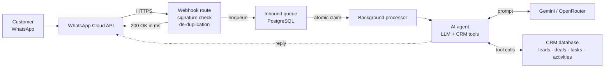

# Mawrid CRM

An Arabic-first CRM for Mawrid, a Saudi business-software company — extended
during a summer training placement with an **autonomous AI sales agent that
talks to customers on WhatsApp and acts on the CRM while it does it**: it
identifies the caller, understands their industry, qualifies them,
creates and routes a lead, and books a demo in a slot that is genuinely free in
the assigned representative's calendar.

Built on Next.js 16 (App Router, React 19, strict TypeScript) and Supabase /
PostgreSQL. Every change ships through a pull request; `main` deploys to
production automatically, and CI type-checks, lints and builds on every push.

---

## The agent, in one picture



The webhook answers in milliseconds and the reply is composed in a background
task. The first version answered only after the whole model conversation
finished; Meta read the delay as a failed delivery, retried, and the customer
received two different replies. Queueing the work fixed it, and a unique index
on the provider's message id makes a retry impossible to process twice.

---

## Where to look

| Area | Path | What is in there |
| --- | --- | --- |
| **AI agent** | [`lib/whatsapp/`](lib/whatsapp) | The agent loop, tool calling, two model providers, output validation |
| ↳ agent loop | [`agent.ts`](lib/whatsapp/agent.ts) | Model chain with runtime discovery, up to three tool rounds, quality gates |
| ↳ tools | [`crmTools.ts`](lib/whatsapp/crmTools.ts) | 8 callable tools and their CRM side effects — 7 offered in a turn, chosen by identity |
| ↳ domain knowledge | [`mawridKnowledge.ts`](lib/whatsapp/mawridKnowledge.ts) | 8 industry playbooks — pain points, modules, discovery question |
| ↳ providers | [`gemini.ts`](lib/whatsapp/gemini.ts) | Gemini adapter, incl. `thought_signature` replay |
| ↳ delivery | [`queue.ts`](lib/whatsapp/queue.ts) · [`processor.ts`](lib/whatsapp/processor.ts) | Queue, atomic claim, retry and parking of failed turns |
| **Data layer** | [`lib/models/`](lib/models) | Every database query in the app lives here — nothing queries from a page |
| **Schema** | [`supabase/migrations/`](supabase/migrations) | Tables, RLS policies, PL/pgSQL functions, indexes |
| **API routes** | [`app/api/`](app/api) | Webhook, cron drain, diagnostics, and the AI features |
| **UI** | [`app/dashboard/`](app/dashboard) | Arabic RTL dashboard: leads, deals, calendar, WhatsApp threads, KPIs |

---

## Design decisions worth defending

**Identity decides capability.** The phone number is resolved against the leads
table *before* the model is called, and that lookup — not the model — chooses
which tools exist for the turn. A recognised lead gets tools that read its own
record; an unknown number gets tools to become a lead. A stranger cannot fish
for another customer's data, because the capability was never on the table.

**Domain knowledge is data, not prompt.** The sales reasoning lives in
[8 industry playbooks](lib/whatsapp/mawridKnowledge.ts) — the problems each
sector has, the modules that solve them, the next question worth asking. A
non-programmer can change how the agent sells without touching a prompt.

**Output is validated in code.** A reply is rejected and the next model is tried
when it opens in the wrong script, reads as leaked internal reasoning, stops
mid-sentence, or repeats a question the customer already answered. Prompts ask
for good behaviour; only code enforces it.

**The provider is replaceable.** Models are discovered at runtime rather than
hard-coded — model names were retired mid-project and took the agent offline —
and there are two providers behind one interface, differing in tool-call shape
and, for Gemini, in the `thought_signature` that must be echoed back with every
replayed call.

**Leads get a real owner.** A rules engine a manager can edit (industry, size
band, source) picks the representative, falling back to a least-recently-used
rotation rather than a counter, which any manual reassignment would corrupt.
Availability is computed from that person's working hours minus their existing
tasks, so the three slots offered to the customer are genuinely free.

---

## Also in this repository

- **A data leak fixed** — every sales representative could see every other
  representative's activities: one query missing an ownership filter, no error,
  no crash. Row-Level Security and server-side auth now enforce ownership.
- **Rate limiting** ([`lib/rateLimit.ts`](lib/rateLimit.ts)) on the AI routes,
  which are metered and were open to abuse.
- **A diagnostics endpoint** (`/api/whatsapp/diagnose`) that reports provider
  quota, model availability and parked messages — built after one too many
  rounds of guessing at production failures from screenshots.
- **CI** ([`.github/workflows/ci.yml`](.github/workflows/ci.yml)) — type-check,
  lint and build on every push and pull request.

---

## Running it

```bash
npm install
npm run dev        # http://localhost:3000
```

Server-side secrets (Supabase service role, WhatsApp Cloud API token and
webhook secret, model provider keys) are read from the environment; the client
uses Supabase's public URL and anon key. Database schema is in
[`supabase/migrations/`](supabase/migrations), applied in filename order.

```bash
npx tsc --noEmit   # type-check
npx eslint app components lib
npm run build
```

---

## Stack

Next.js 16 · React 19 · TypeScript (strict) · Supabase / PostgreSQL with RLS ·
WhatsApp Cloud API · Gemini and OpenRouter · Vercel (deploys and cron)
